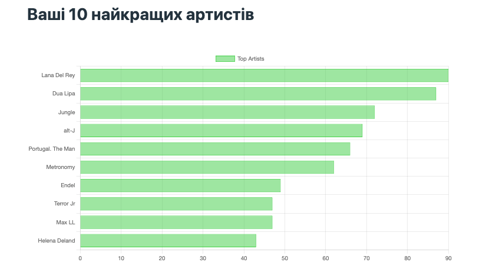

# SpotifyStats

## Огляд
Цей веб-застосунок Flask інтегрується з API Spotify для відображення специфічних для користувача даних, таких як нещодавно прослухані треки, найпопулярніші виконавці та статистичні дані про їхні слухацькі вподобання. Він використовує бібліотеку Spotipy для інтеграції з API Spotify та Flask для веб-фреймворку.

## Можливості
- Відображати нещодавно відтворені треки
- Показувати топових виконавців і треки на основі даних користувача Spotify
- Надайте статистичну інформацію про звички користувачів щодо прослуховування
- Автентифікація OAuth2 у Spotify

## Передумови
- Python 3
- Flask
- Spotipy
- Обліковий запис та облікові дані розробника Spotify (ідентифікатор клієнта, секрет клієнта та URI перенаправлення)

## Встановлення
1. Клонуйте репозиторій.
2. Встановіть необхідні пакети Python: `pip install -f requirements.txt`.
3. Задайте свої облікові дані розробника Spotify як змінні середовища або безпосередньо в скрипті:

    SPOTIFY_CLIENT_ID = 'your_client_id'
    
    SPOTIFY_CLIENT_SECRET = 'your_client_secret'
    
    SPOTIFY_REDIRECT_URI = 'your_redirect_uri'

4. Запустіть програму: `python app.py`.

## Використання
- Отримайте доступ до вебзастосунку через `localhost:8080` або налаштований хост і порт.
- Увійдіть, використовуючи свої облікові дані Spotify.
- Переглядайте нещодавно відтворені треки, найпопулярніших виконавців та іншу статистику.

## Користувацькі фільтри
- `dateformat`: Форматує об'єкти часу даних у зручний для читання формат.
- `durationformat`: Перетворює тривалість доріжки з мілісекунд у формат хвилини:секунди.

## Маршрути
- `/`: Головна сторінка з нещодавно відтвореними треками.
- `/login`: Ініціює процес входу до Spotify.
- `/callback`: Обробляє зворотний callback від Spotify OAuth.
- `/logout`: Виводить користувача з програми.
- `/statistics`: Відображає статистичні дані про найпопулярніших виконавців і треки користувача.
- `/policy`: Заповнювач для інформації про політику.

## Acknowledgements
Цей проект побудовано з використанням фреймворку Flask та бібліотеки Spotipy. Він призначений для навчальних цілей і не є комерційним продуктом.

## Примітки
- Переконайтеся, що ваші облікові дані розробника Spotify зберігаються у безпеці.
- Наразі застосунок налаштовано на запуск на `localhost:8080`. Це можна змінити у скрипті.

## Автор
Віталій Власов
